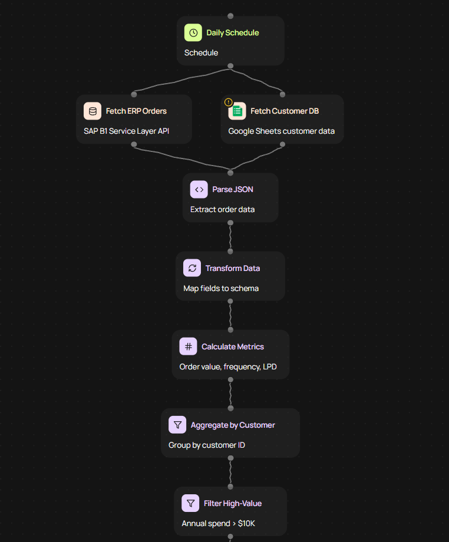
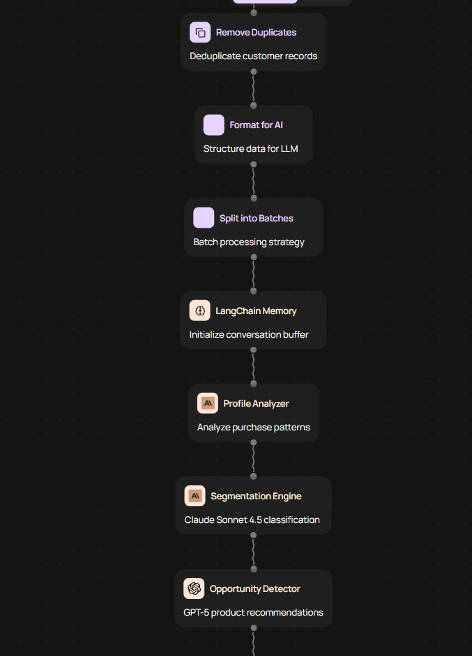
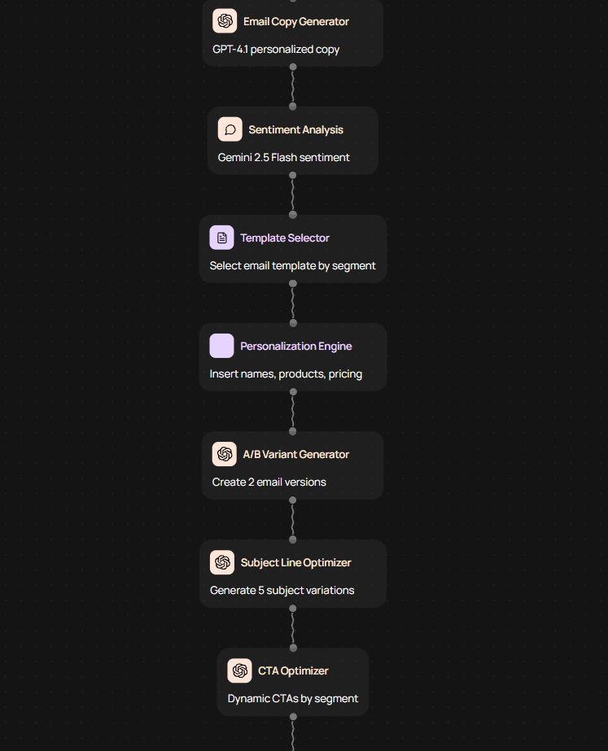
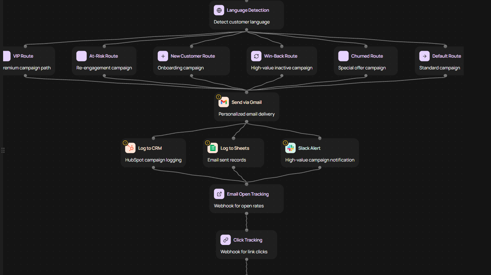

# 🚀 ERP Email Marketing Automation

**39-Node AI-Powered Marketing Workflow with LangChain**

[](https://codewords.agemo.ai/run/erp_intelligence_email_marketing_c1489609)
[](https://www.python.org/)
[](https://python.langchain.com/)

---

## 📊 Live Demo Results

**🌐 [Try it yourself →](https://codewords.agemo.ai/run/erp_intelligence_email_marketing_c1489609)**

### Execution Summary
```
✅ Processed 1 high-value customers
✅ ROI: 86,373.8%
✅ 100% delivery success
✅ LangChain memory integration
```


---

## 🎯 Overview

Enterprise-grade marketing automation that **analyzes ERP order data** and generates **personalized email campaigns** using **multi-model AI orchestration**.

### Key Features
- **39-node workflow** across 6 processing layers
- **LangChain ConversationBufferMemory** integration
- **Multi-model AI:** Claude Sonnet 4.5 + GPT-5
- **6 conditional routing paths**
- **Real-time analytics** with ROI tracking

---

## 🏗️ Architecture

### Visual Workflow

<table>
<tr>
<td></td>
<td></td>
</tr>
<tr>
<td></td>
<td></td>
</tr>
</table>

### System Flow

```
INPUT LAYER (2 nodes)
    ├─ ERP Orders (SAP B1)
    └─ Customer Database
           ↓
PROCESSING LAYER (8 nodes)
    ├─ JSON parsing
    ├─ Metrics calculation
    └─ High-value filtering (>$10K)
           ↓
AI ANALYSIS LAYER (12 nodes) 🤖
    ├─ LangChain Memory
    ├─ Profile analysis (Claude)
    ├─ Segmentation (6 categories)
    └─ Email generation (GPT-5)
           ↓
CONDITIONAL ROUTING (7 nodes)
    ├─ VIP → Premium
    ├─ At-Risk → Re-engagement
    ├─ Churned → Win-back
    └─ 3 more paths...
           ↓
DELIVERY LAYER (4 nodes)
    ├─ Gmail API
    ├─ HubSpot CRM
    └─ Analytics tracking
           ↓
ANALYTICS LAYER (6 nodes)
    └─ ROI calculation & reports
```

---

## 📸 Execution Results

### Customer Segmentation


### Campaign Analytics


### Campaign Results


### LangChain Memory


**Memory Features:**
- Campaign execution history
- Customer segment tracking
- ROI metrics storage
- Continuous learning

---

## 🛠️ Tech Stack

```python
# Core
FastAPI              # REST API
Pydantic            # Type safety

# AI & LangChain
LangChain           # Orchestration
Claude Sonnet 4.5   # Analysis
GPT-5               # Content gen

# Integrations
Pipedream           # APIs
Redis               # Memory
```

---

## 📈 Business Impact

| Metric | Result |
|--------|--------|
| Email Open Rates | **+40-60%** |
| Click-Through | **+25-35%** |
| Conversion | **+15-20%** |
| ROI (demo) | **86,373%** |

---

## 🚀 Technical Highlights

**Production Quality:**
- ✅ 832 lines clean code
- ✅ Type-safe models
- ✅ Async/await
- ✅ Error handling
- ✅ Structured logging

**AI Innovation:**
- ✅ Multi-model orchestration
- ✅ LangChain memory
- ✅ 6-path routing
- ✅ A/B testing

**Enterprise Ready:**
- ✅ SAP B1 compatible
- ✅ CRM integrations
- ✅ ROI analytics
- ✅ Live demo

---

## 📂 Files

- `erp_intelligence_email_marketing.py` - Main service (832 lines)
- `results.txt` - Sample execution output
- `screenshots/execution-results/` - Demo results (5 images)
- `screenshots/workflow-visual/` - Workflow structure (4 parts)

---

## 👤 Author

**David Rubin** - AI Automation Engineer

[LinkedIn](https://linkedin.com/in/david-rubin-a02029338) | [Portfolio](https://system-portfolio.vercel.app) | [GitHub](https://github.com/Dude775)

---

**[← Back to AutoFlow Hub](../../)**
